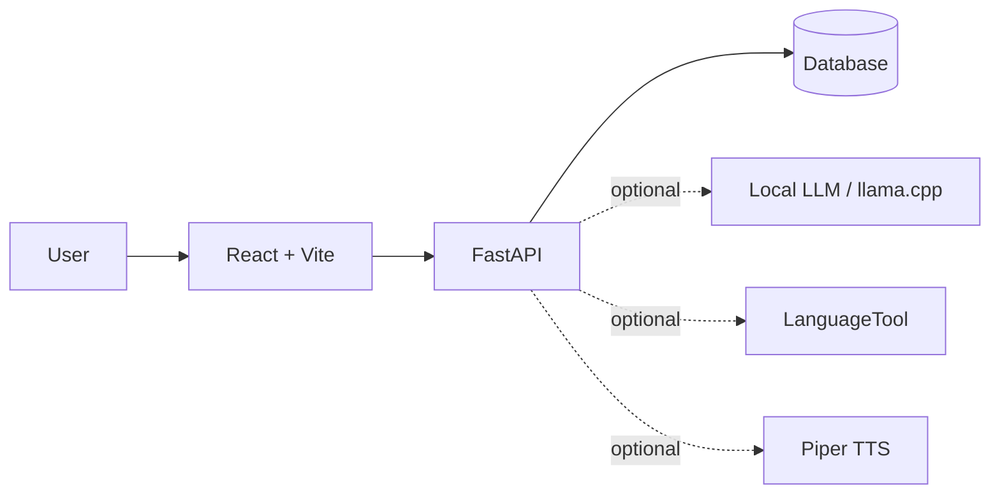

# Portfolio Summary

## Project concept

`wordbridge-coach` is a local-first language-learning application that combines structured vocabulary practice with optional AI-assisted coaching and local text-to-speech.

The project goes beyond a single cloze exercise: it combines cards, spaced repetition, study modes, conversational coaching, audio, and local model integrations in one application stack.

## What this project demonstrates

- FastAPI backend and React/Vite frontend separation;
- containerized local development with Docker Compose;
- database migrations and seeded development data;
- optional local LLM integration through `llama.cpp`;
- optional local TTS through Piper;
- LanguageTool integration;
- configurable service ports and Docker networking;
- smoke testing for a complete local workflow;
- backup and restore tooling;
- operational documentation and architecture decision records.

## High-level architecture

## Engineering decisions

### Local-first AI

AI and audio services are optional profiles rather than mandatory dependencies. The core application can run without loading an LLM or TTS runtime, reducing memory, VRAM, startup time, and operational coupling during ordinary development.

### Reproducible development

The project provides scripts for startup, smoke testing, database backup/restore, and frontend tooling. Host ports and the Docker subnet can be overridden to coexist with other development stacks.

### Separation of product and legacy identifiers

The product is branded as WordBridge Coach while some internal `filltheword_*` identifiers remain for operational compatibility. This allows the product model to evolve without forcing unnecessary migration of every internal identifier at once.

## Scope

The repository is primarily a local application and engineering project. A production deployment would require environment-specific hardening around infrastructure, secret management, external identity, monitoring, backups, scaling, and deployment automation.

For current setup and operational commands, see [`README.md`](README.md). For deeper technical context, see [`docs/ARCHITECTURE.md`](docs/ARCHITECTURE.md), [`docs/DECISIONS.md`](docs/DECISIONS.md), and [`docs/PROJECT_STATUS.md`](docs/PROJECT_STATUS.md).
